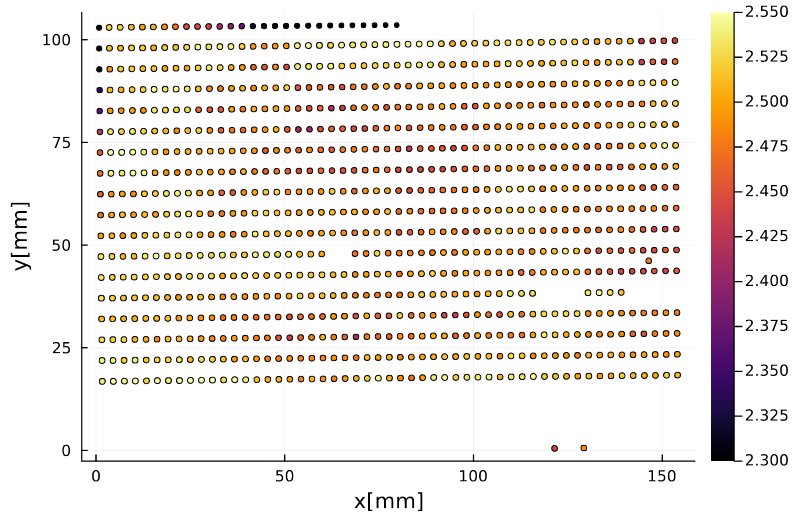

# DRASTIC
**D**une c**R**p **A**node**S** pho**T**o qual**I**ty **C**ontrol 

Julia software developed at LAPP to perform quality assurance/control of DUNE CRP anodes based on image analysis

# Usage
To use the software you need ot make available in you workspace Julia, which is available at lxplus, cc in2p3, etc 
Once you have make Julia available, you can simple install the DRASTIC package by doing inside julia
```
]add https://github.com/lmanzanillas/DRASTIC
```
The previous command will install the DRASTIC package 
In addition to the DRASTIC package we recomend to install the following complementary packages for analyzing the results
```
]add Images, ImageFeatures, FileIO, Plots, ImageComponentAnalysis, Statistics, StatsBase, HDF5
```

# Step by step example
The Quality control of the CRP anodes will check if the pitch of the PCB holes correspond to the required specifications and if no anomalous pattern is observed
To perform this QC photos will be taken of the PCBs/anodes that will be analyzed to extract the required paramters for the analysis
Since the axes of the 2D images are in pixels we will need to find a calibration factor to convert pixel units to mm. To this end a photo with calibration red circles will be used. The diameter of these circles is about 10 mm.


Then we need to define the color that will be used as reference for the calibration, i.e. the red color. To this end, we will select a region of the red circles that we will convert to the HSV color space. The photo is a matrix of 3456 x 5184 pixels. You can use ```plot(c_img[1900:2050,4300:4500])``` to make sure are selecting the good region.


You can use the same image to define the hole color, which corresponds to the center of the holes (the blueish part). The idea will be take a hole placed in the center of the image. In this case: 
```python
hole_color = HSV{Float32}( mean(c_img[1505:1550,2635:2685]))
```


## Calibration factor
The first parameter that we need to find is the calibration factor. To this end the function
```python
get_calibration_factor
```
can be used. This function need an image with the red circles and a color as reference, in this case the red color
```python
calib = get_calibration_factor(c_img,red_color)
```

## Analysis  of a photo
Once the calibration factor has been found we can proceed with the analysis
First we read a photo for the analysis
```python
light_dir = "/home/manzanilla/Pictures/DUNE_PCBs_QA/50mm_test/"
my_photos = light_dir .* filter(x->occursin("002.jpg",x), readdir(light_dir))
testing_img = load(my_photos[1])
```


Since the light can be different in different regions of the photo, we will divide the photo in small section to have more homogenous results in all the photo. To do that, you can use the following function
```python
div_img, indexv = divide_img_sq(testing_img,430);
```
which will divide the photo in section of 430x430 pixels (except the last section that will be adjusted to keep the total amount of pixels)
This function will return a vector containing the sections and a matrix containing the position of each section to allow the merging of all sections into the original image

For each section we will find the optimal selection to identify the holes of the PCB. First we founc the distance from each pixel to the hole color. In the following we will use a single section to show how the DRASTIC works
```python
d_h = color_dist.(div_img[1],hole_color)
```
Then we will find the columns of holes and we will compute the average hole (blueish) color in that section
```python
h_peaks = get_horizontal_pitch(d_h)
h_avg_color = get_average_color(div_img[20],d_h,h_peaks)
```
We compute the refined distance using the average hole color of that section and we make an histogram to identify the required cut to isolate the copper regions. The funtion ```get_max_h(h,0.25)``` can be used to find the maximum which corresponds to the copper region, the 0.25 is used to avoid the region of the histogram close to 0. Then the cut is found using ```get_selection(d_refined,h_max,2.50)``` the 2.5 corresponds to 2.5 sigma on the left with respect to the maximum, which works for most of the cases, but 2.5 sigma could be adjusted if needed
```python
h = fit(Histogram,vcat(d_refined...),0:0.01:0.75)
h_max = get_max_h(h,0.25)
c = get_selection(d_refined,h_max,2.50)
```


Then we apply the section to convert the section to a binary image, 1 corresponding to the hole and 0 to the copper, in that way we can isolate the holes for analysis. We can plot to make sure that all worked fine
```python
d_s = d_refined .< c
heatmap(d_s)
```


If the binary image looks ok, we can process and obtain the holes info by using the functions:
```python
min_area_hole = π*(calib*2.0/2)^2
max_area_hole = π*(calib*3.0/2)^2
s_result = get_holes_info(d_s,min_area_hole,max_area_hole)
```
where we have used min_area_hole and max_area_hole to filter the badly reconstructed holes, if all was calibrated correctly, the function will return a matrix with the coordinates and diameter of holes in pixels. If you want to convert the diameter to mm, just use
```python
s_result[:,3]/calib
```
The values should be close to 2.4mm 
Once we have verified that all worked fine, we can apply the same procedure but for the image, which will take about 15  min or more depending on your machine.
```python
d_selection = []
for section in div_img 
    d_h = color_dist.(section,hole_color)
    h_peaks = get_horizontal_pitch(d_h)
    h_avg_color = get_average_color(section,d_h,h_peaks)
    d_refined = color_dist.(section,h_avg_color)
    h = fit(Histogram,vcat(d_refined...),0:0.01:1.0)
    h_max = get_max_h(h,0.25)
    
    c = get_selection(d_refined,h_max,2.5)

    d_s = d_refined .< c
    push!(d_selection,d_s)
end
```
You can merge the sections using
```python
full_bin = merge_divided_binary_img(d_selection,indexv)
full_bin = full_bin[end:-1:1,:]
```


And to obtain the info of the holes, just use
```python
results = get_holes_info(full_bin_mirror,min_area_hole,max_area_hole)
```
To plot the results use
```python
results_f = filter(x-> 2.3< x < 2.8,results[:,3]/calib)
μ = round(mean(results_f),digits=3)
σ = round(std(results_f),digits=3)
h_pitch = fit(Histogram,results_f,2.2:0.01:2.8)
plot(h_pitch,st=:step,label="μ = $(μ)mm, σ = $(σ) mm",xlabel="d [mm]",legend=:topright)
```


and for the 2D plots use: 
```python
scatter(results[:,1]/calib,results[:,2]/calib,xlabel="x[mm]",ylabel="y[mm]",label="",ms = results[:,3]/calib, marker_z = results[:,3]/calib,clims=(2.3,2.55))
```


abd to obtain the pitch
```python
p = get_pitch(results,calib,0.2)
```
which will return the coordinates and pitch. Then you can plot the results. For the histogram of the distribution use
```python
p3_f = filter(x-> 2.8< x < 3.1, p[:,3])
μ = round(mean(p3_f),digits=3)
σ = round(std(p3_f),digits=3)
h_pitch = fit(Histogram,p3_f,2.5:0.01:3.1)
plot(h_pitch,st=:step,label="μ = $(μ)mm, σ = $(σ) mm",xlabel="pitch [mm]",legend=:topleft)
```


And for the 2D use
```python
p = p[p[:,3] .< 3.1,:]
scatter(p[:,1]/calib,p[:,2]/calib,marker_z = p[:,3],label="",xlabel="x[mm]",ylabel="y[mm]",clims=(2.85,3.05),colorbar_title ="pitch [mm]")
```


